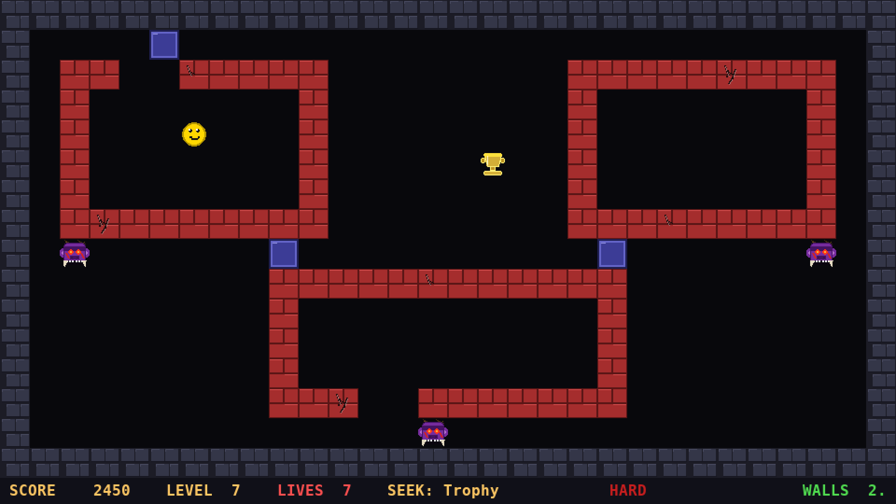
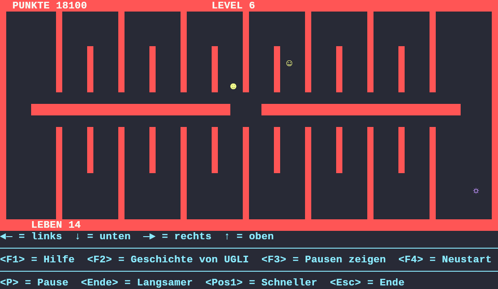

# UGLYCRAFT

A Python/pygame spiritual remake of **UGLI** (1996), a DOS treasure-hunt game originally written in Turbo Pascal 7.

Collect nine treasures across ten progressively harder levels while being hunted by an ever-closing enemy. Outsmart it by placing walls, buying a shield, or simply staying one step ahead.

**Download compiled binaries (Linux, Windows, and the original DOS game) at [dbausch.itch.io/uglycraft](https://dbausch.itch.io/uglycraft).**



---

## Features

- Ten hand-crafted levels with increasingly complex wall layouts
- Level 10: a boss enemy with BFS pathfinding and its own locked vault
- Three ogre enemy types that escalate in appearance across level groups
- Interactive wall placement — block the enemy's path on the fly
- Instant shield purchase — absorbs one hit, no shop screen
- Procedural sound effects and music — no external audio files
- High-score table persisted to disk
- All sprites drawn procedurally — no external image files
- Fixed 960×540 logical resolution, integer-scaled to fit any display; F11 toggles fullscreen

---

## Requirements

- Python 3.10 or later
- [pygame](https://www.pygame.org/) 2.x
- [numpy](https://numpy.org/) (for sound; game runs silently without it)

---

## Installation

Install the required tools if you don't have them yet:

```bash
sudo apt install pipx python3-virtualenv   # Debian / Ubuntu
sudo pacman -S python-pipx python-virtualenv  # Arch / Manjaro
pipx ensurepath         # add ~/.local/bin to PATH (then restart your shell)
pipx install poethepoet
```

Then set up the game:

```bash
git clone <repo-url>
cd uglycraft
poe install
```

---

## Running

```bash
poe run
poe run-level 5          # start at a specific level
```

Or directly:

```bash
.venv/bin/python main.py --level N        # start at level N (1–10)
.venv/bin/python main.py --easy/--hard    # set difficulty (default: easy)
```

---

## Controls

| Key | Action |
|---|---|
| Arrow keys | Move; bump a wall 3× to mine it |
| Space | Place wall on current tile (costs 1 credit) |
| Enter | Buy shield instantly (250 pts, lasts 10 s) |
| P | Pause / unpause |
| Escape | Quit to menu |
| F10 | Skip to next level (cheat) |
| F11 | Toggle fullscreen |

---

## Scoring

Each level contains nine treasures to collect in sequence. Points are awarded on collection:

| # | Treasure | Points |
|---|---|---|
| 1 | Coin | 100 |
| 2 | Big Diamond | 200 |
| 3 | Small Gems | 300 |
| 4 | Trophy | 400 |
| 5 | Gold Ingot | 500 |
| 6 | Platinum Ingot | 600 |
| 7 | Necklace | 700 |
| 8 | Lantern | 800 |
| 9 | Emerald | 900 |
| 10 | Crown (level 10 only) | 1000 |

**Final score** = accumulated points × lives remaining.  
Being caught without a shield costs 500 points and one life.

---

## Tasks (poethepoet)

```bash
poe run                    # run the game
poe run-level N            # run starting at level N
poe build-linux            # build dist/linux-64/uglycraft
poe build-windows          # build dist/windows-64/uglycraft.exe (requires Wine setup below)
poe build-original         # build original/UGLI_2 with FPC
poe deploy                 # build all + push all four channels to itch.io
poe deploy-original-linux  # build + push FPC Linux port only
poe deploy-original-dos    # push original DOS exe only
```

`poe deploy` reads the version from the latest git tag automatically.

---

## Building a Linux executable

No cross-compilation needed — PyInstaller runs natively.

### One-time setup

```bash
.venv/bin/pip install pyinstaller
```

### Building

```bash
.venv/bin/pyinstaller --onefile --noconsole --name uglycraft main.py
```

Output: `dist/uglycraft` (~41 MB, self-contained).

### Testing

```bash
dist/uglycraft
```

---

## Building a Windows executable (from Linux)

### One-time setup

Requires Wine and the Python 3.13 Windows installer (Python 3.14 is not yet supported by pygame's Windows wheels).

```bash
# 1. Install Wine
sudo pacman -S wine          # Arch / Manjaro
# sudo apt install wine      # Debian / Ubuntu

# 2. Download Python 3.13 for Windows
curl -LO https://www.python.org/ftp/python/3.13.0/python-3.13.0-amd64.exe

# 3. Install Python into Wine
#    In the GUI: tick "Add Python to PATH", then Install Now
wine python-3.13.0-amd64.exe

# 4. Install dependencies into the Wine Python
WINEDEBUG=-all wine \
  ~/.wine/drive_c/users/$USER/AppData/Local/Programs/Python/Python313/python.exe \
  -m pip install pygame numpy pyinstaller
```

### Building

```bash
WINEDEBUG=-all wine \
  ~/.wine/drive_c/users/$USER/AppData/Local/Programs/Python/Python313/python.exe \
  -m PyInstaller --onefile --noconsole --name uglycraft main.py
```

Output: `dist/uglycraft.exe` (~25 MB, self-contained).

The Wine prefix and all dependencies persist — subsequent rebuilds only need the PyInstaller command above.

### Testing

```bash
wine dist/uglycraft.exe
```

---

## Building the ported original (UGLI 2)

The original 1996 Pascal source has been ported to run on modern Linux using Free Pascal.

### One-time setup

```bash
sudo pacman -S fpc          # Arch / Manjaro
# sudo apt install fpc      # Debian / Ubuntu
```

### Building

```bash
.venv/bin/poe build-original
```

Or directly:

```bash
cd original && fpc -Mtp UGLI_2.PAS
```

Output: `original/UGLI_2` (native Linux executable).

### Running

```bash
./original/UGLI_2
```

Requires a terminal of at least 80×25 characters. Tested in [kitty](https://sw.kovidgoyal.net/kitty/). See [`original/README.md`](original/README.md) for full details of the porting work.

---

## Publishing to itch.io

Requires [butler](https://itch.io/docs/butler/) and a one-time `butler login`.

```bash
butler push dist/uglycraft     dbausch/uglycraft:linux-64   --userversion 1.0
butler push dist/uglycraft.exe dbausch/uglycraft:windows-64 --userversion 1.0
```

---

## Project structure

```
main.py        Entry point, display scaling, event loop
game.py        State machine, game logic, rendering
constants.py   Resolution, tile size, colours, timing
sprites.py     All sprites drawn procedurally (no image files)
levels.py      Ten level definitions (wall patterns + enemy starts)
entities.py    Player and Enemy classes (BFS pathfinding for boss)
sounds.py      SoundManager — 14 SFX + 12 music tracks, all procedural
hiscore.py     Top-10 score persistence (uglycraft.hsc)
```

---

## Origins

UGLI was first written in 1993 by Daniel Bausch using Turbo Pascal on MS-DOS, then developed further through 1996 into a second version with improved mechanics including wall placement. The 1996 source code (`UGLI_2.PAS`, `DANISOFT.PAS`, `EXTRA1.PAS`) is preserved in this repository as a historical reference. UGLYCRAFT shares the genre and core mechanics but is otherwise a fresh implementation.



The screenshot above is taken from the Free Pascal port of the original, running in a Linux terminal. The video below is a let's play of the original DOS executable in DOSBox:

[](https://youtu.be/czsqF9CXxNE?si=ySZGeo_gj0kxmMw6)

---

## License

UGLYCRAFT is free software: you can redistribute it and/or modify it under the terms of the **GNU General Public License version 3** as published by the Free Software Foundation.

See [LICENSE](LICENSE) for the full text.

### Third-party licenses (distributables)

The standalone executables bundle the following third-party libraries:

| Library | License | Full text |
|---------|---------|-----------|
| pygame | LGPL 2.1 | `LICENSES/LGPL-2.1.txt` |
| numpy | BSD 3-Clause | `LICENSES/BSD-3-Clause-numpy.txt` |

See `LICENSES/NOTICE.txt` for a summary of bundled components and how to obtain their source.
